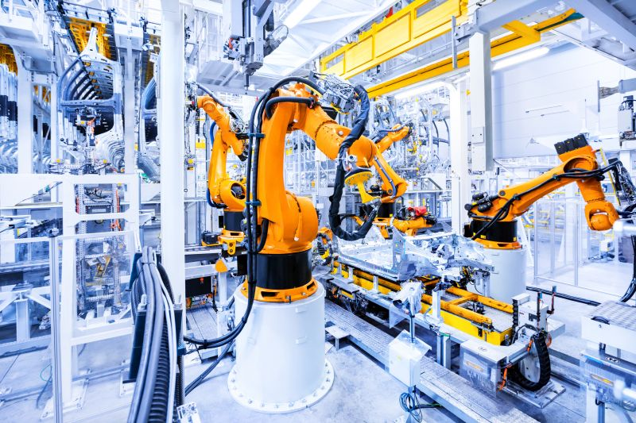

# Robotics DB

This is a students project from CBS International Business School for the lecture _Digital Organization_.

This file contains for sections:

[Market and market sizes](https://github.com/DrUlrichAnders/2021ws_do_roboticsdb/blob/main/roboticsDB.md#markets-and-market-sizes)

[Product and robot types](https://github.com/DrUlrichAnders/2021ws_do_roboticsdb/blob/main/roboticsDB.md#products-and-robot-types)

[Applications](https://github.com/DrUlrichAnders/2021ws_do_roboticsdb/blob/main/roboticsDB.md#applications)

[Producers](https://github.com/DrUlrichAnders/2021ws_do_roboticsdb/blob/main/roboticsDB.md#producers)

---

## Markets and market sizes

### Markets

The robotic industry can be divided into industrial and service robotics.

Industrial robots are defined by their use in a manufacturing environment. Service robots are divided into commercial and personal robotics:

- Commercial service robots are used to perform a service in an industrial environment
- Personal service robots are deployed in private households.

Examples for End-Users of robots:

Industrial Robots: Automotive, Food and Beverage, Electronics etc.

Service Robots: Logistics, Military and Defense, Medical and Healthcare etc.

[Source](https://www.mordorintelligence.com/industry-reports/robotics-market)

### Robot density — key figures

A kind of automation race has started in the world, because automation brings important competitive advantages. It is important for a country to know its state of development in the world in order to identify opportunities to implement automation strategies more effectively. One important indicator for this is robot density. This is calculated from the number of industrial robots in the operational inventory in relation to the number of employees.
This indicator makes it possible to compare nations of different sizes in the global automation race, even if they are of different sizes and the conditions are different in each case.
Below you will find an overview of the regions with the highest robot density and thus the largest sales markets for robots.

[Source](https://www.weka.de/einkauf-logistik/deutschland-unter-top-10-der-automatisierten-laender/)

| Ranking |   Country   | Robot density |
| :-----: | :---------: | :-----------: |
|    1    |  Singapore  |      918      |
|    2    | South Korea |      868      |
|    3    |    Japan    |      364      |
|    4    |   Germany   |      346      |
|    5    |   Sweden    |      274      |
|    6    |   Denmark   |      243      |
|    7    |  Hong Kong  |      242      |
|    8    |   Taiwan    |      234      |
|    9    |     USA     |      228      |
|   15    |    China    |      187      |

Example of 1st place :

In Singapore, 918 robots account for every 10,000 employees, 75% of whom work in the electronics industry, with a focus on the manufacture of semiconductors and computer peripherals.

[Source](https://zukunft-technik.de/roboterdichte/)

### Development of the global market for robots

[Source](https://www.mordorintelligence.com/industry-reports/robotics-market)

### Market size

Robot Market size exceeded USD 3 billion in 2020 and is anticipated to grow at a CAGR of over 15% between 2021 and 2030. The growing demand for UVC disinfection and service robots to mitigate the spread of COVID-19 virus and support public safety is driving the market growth globally.

1. Robotic Process Automation (RPA) Market is estimated to reach USD 2,467.0 million by 2022, at a CAGR of 30.14% between 2017 and 2022. The base year considered for the study is 2016 and the forecast period is between 2017 and 2022.

1. The industrial robotics market is projected to reach USD 75.3 billion by 2026, it is expected to grow at a CAGR of 12.3% from 2021 to 2026.

---

* This video gives us a Market Forecast for 2024
! [Market report 2024](https://www.youtube.com/watch?v=NgpDoQ6Vu7I)

---

##### Size of the global market for industrial robots
* This table shows the revenue from 2018-2028
! [Statista](https://www.statista.com/statistics/760190/worldwide-robotics-market-revenue/)

---

##### Global market leader 
* Asia remains the strongest market for industrial robots
* Followed by the United States and than Europe
* This table shows the 15 largest markets

---

---

Source:

+[https://www.gminsights.com/industry-analysis/robot-market](https://www.gminsights.com/industry-analysis/robot-market)

+[https://www.alliedmarketresearch.com/robotics-technology-market](https://www.alliedmarketresearch.com/robotics-technology-market)

---

## Products and robot types

---

In general, it is not that easy to categorize robots. Each of them has its own unique features, which various robots also share. In the following some important robot types are listed:

### Industrial robots

Industrial robots conist of various axis. Most of the industrial robots have **six axis** (six degrees of freedom), as they are more flexible and perform a broad variety of application.

* Axis 1:
Located at the base of the robot -> move left/right, rotate 180 degree from center
Also called: Motoman: S and Fanuc: J1

* Axis 2:
Responsible for the movement of the lower arm. -> move forward/backward
Also called: Motoman: L and Fanuc: J2

* Axis 3:
Responsible for the upper arm to raise and lower -> move vertical
Also called: Motoman: U and Fanuc: J3 

* Axis 4:
Connection with Axis 5, Positioning end effector and manipulation of the part -> move circular
Also called: Motoman: R and Fanuc: J4 

* Axis 5:
Responsible for the wrist to pitch and yaw -> move up/down
Also called: Motoman: B and Fanuc: J5

* Axis 6:
Wrist of the robot -> move circular (360 degree)
Also called: Motoman: T and Fanuc: J6.

 

[Video of a working 6-axis robot](https://www.youtube.com/watch?v=7coUcEHxnYA&t=59s)

Source: https://www.robots.com/faq/what-are-six-axis-robots 

### Delivery robots

A delivery robot come with different shape and sizes. Some robots deliver food and look like carts with wheels other delivery robots look like humans.
Delivery robots enhance the speed of delivery, lower labor costs and reliability.

These robots are also known as autonomous robots:
Autonomous robots operate independently of human operators. These robots are usually designed to carry out tasks in open environments that do not require human supervision

[Example video of a food delivery](https://www.youtube.com/watch?v=13jqscTESNM)

### Logistic robots

[Meet the Robots at Amazon](https://www.youtube.com/watchv=HSA5Bq-1fU4)

Amazon provides a good example of how humans and robots can work together harmoniously. In Amazons fulfillment centre robots and people work together to pick, sort and transport packages to get them to their customers on time. Moreover, robots can pick heavy items and bring products directly to employees. Therefore the employees can concentrate on more important task.

80% of the warehouses do not use automation or robotics. But Automated Guided Vehicles (AGVs) and Autonomous Mobile Robots (AMRs) are one of the fastest growing types of robots for transportation of goods at the moment.

### Collaborative robots

A collaborative robot (cobot) is an industrial robot that works together with humans and is not separated from them in the production process by protective devices.

Source: [Yaskawa - https://www.yaskawa.eu.com/products/robots/smart-series#learn](https://www.yaskawa.eu.com/products/robots/smart-series#learn)

### Humanoid robots

Tesla is already revealing initial concepts of a humanoid robot that will be able to perform repetitive, tedious and dangerous tasks. Called "Tesla Bot," the robot is expected to be 1.70 m tall, weigh about 56 kg, carry a load of 20 kg and be able to lift nearly 70 kg from its cross.

"Atlas" the humanoid robot from Boston Dynamics already shows how far advanced research and this field is. For a better insight you will find below a link to a video in which the current development status of Atlas is presented.

[Atlas parkour skills](https://www.youtube.com/embed/tF4DML7FIWk)

### Pre-Programmed Robots

- Pre programed robots can do work that people would get tired of repeating over and over. These robots never take a lunch break or any break! You might have to repair them once in a while. They also have very good accuracy.These robots can drive cars, make cars and even fix cars.

- Pre-programmed robots operate in a controlled environment where they do simple, monotonous tasks. Examples of a pre-programmed robot would be:

1. a mechanical arm on an automotive assembly line
1. Factory robots
1. The robot mip
1. The cyber knife

Source: [https://edu.glogster.com/glog/pre-programmed-robots/23s7cv8m6xo?=glogpedia-source](https://edu.glogster.com/glog/pre-programmed-robots/23s7cv8m6xo?=glogpedia-source)

### Domestic Robots

In contrast to the other robots already presented in this document, there are some kinds of robot which find use in common households. Most have actually been in use for a few years already and have undergone a lot of changes since their first introduction to the market.

These Robots usually take over tasks which tend to be considered boring or repetitive, for example cleaning or landscaping. This has 2 main advantages. Firstly, these tasks are rather simple to automate. Secondly, due to the monotonous nature of these tasks the demand for an automatic solution was rather high.
The first Household Robots therefore took over tasks such as trimming lawns, cleaning pools, or vacuuming rooms.

Over the years, the functionality of these kinds of robots was improved. In the beginning, the robots would follow simple or rather random patterns until they were low on battery or 'considered' their work finished. Nowadays, they can map out certain areas, for example singular rooms or certain areas of lawn, which they will systematically take care of.

This allows the robots to be not only more time efficient but often times also more energy efficient.

Source: [http://www.vacuumcleanerhistory.com/vacuum-cleaner-development/domestic-robots-history-and-future/](http://www.vacuumcleanerhistory.com/vacuum-cleaner-development/domestic-robots-history-and-future/)

---

## Applications

### Robotic Applications in Automotive Manufacturing

#### 1) Robotic Vision

- [Automated vision](https://www.roboticstomorrow.com/article/2014/07/automated-vision-inspection-and-parts-traceability-in-automotive-assembly-process/4410/) with a camera for feedback
- Perform proper offsetting when installing a part
- Installation of: door panels, windshields, and fenders

#### 2) Spot and Arc Welding

- [Arc welding](https://www.youtube.com/watch?v=HUU3HdxOqZs)
- [Spot welding](https://www.youtube.com/watch?v=v5wcRRdkrsU)
- Preserving high welding standards

#### 3) Assembly

- Assemble [smaller parts](https://www.automate.org/industry-insights/small-assembly-robots-with-big-gains) (motors and pumps) with [high speed (Example Mitsubishi)](https://www.youtube.com/watch?v=Hp3rN6_AS8k)
- Screw driving, windshield installation, wheel mounting

#### 4) Paining, Sealing & Coating

- [Cover large areas and limiting waste](https://www.youtube.com/watch?v=97KLjusbP2Y) (ABB & Volvo)
- Spraying adhesives, sealants, and primers

#### 5) Machine Tending and Part Transfer

- Transferring metal stamps
- Loading and unloading [CNC machines](https://meshautomationinc.com/robotic-machine-tending/cnc-load-and-unload/)
- Pouring molten metal in a foundry

#### 6) Materials Removal

- [Trimming flash from plastic moldings](https://www.youtube.com/watch?v=QvPZhCkR3SU)
- Polishing molds
- Cutting fabric

#### 7) Internal Logistics

- Autonomous mobile robots (AMRs)
- AMRs from Mobile Industrial Robots (MiR) to deliver on the factory floor ([Case Study: Ford](https://www.roboticsbusinessreview.com/case_studies/case-study-why-ford-deployed-amrs-to-automate-spanish-factory/))

### Robots in Material Handling

- Moves parts or products at scale - reducing changeover time.
- Saving floorspace and maintaining consistency.

### Robots for Logistics

- A viable option for automation of complex tasks.
- Exceeding speed and accuracy of manual labor.
- Reducing worker injuries and product damage.

### Robots for Picking and Packing

- Adds speed, flexibility and consistency to secondary packaging applications such as:

  - tray packing
  - tray handling
  - case packing
  - case erection and handling
  - bottle packing
  - shrink-wrapping
  - pouch handling and more ....

### Robots for Palletizing

[Palletizing continues to be one of the fastest growing robotic applications.](https://youtu.be/xrEbGtVxYUk)

### Robots in Healthcare

- performance of surgerie/neurosurgerie with robots
- streamlining supply delivery and disinfection
- freeing up time for providers to engage with patients
- During COVID-19, deploying robots for tasks with direct patient contact

| Benefits               | Risks and Challenges                          |
| ---------------------- | --------------------------------------------- |
| Quality patient care   | Legal uncertainty in case of surgery accident |
| Operational efficiency | High cost                                     |
| Safe work environment  | Training for medical staff needed             |

[Want to see the Da Vinci surgical system in action?](https://www.youtube.com/watch?v=KNHgeykDXFw)

### Robots in Agriculture

- Robots can support farmers by automating repetitive routine-tasks, improving efficiency through their accuracy and speed.

- Robot tasks in agriculture include:
  - Harvesting and picking
  - Weed control
  - Autonomous mowing, pruning, seeding, spraying and thinning
  - Phenotyping
  - Sorting and packing
  - Utility platforms

### Robots in Military

- Robots can be used in military to take over tasks that would be too dangerous for humans
- They endure harsh conditions and traverse difficult terrain, which allows them to even operate under difficult circumstances

- Despite numerous benefits, using robots in military does not come without ethical questions

[Hellström, 2013: On the moral responsibility of military robots](https://link.springer.com/content/pdf/10.1007/s10676-012-9301-2.pdf)

---
### Robots in Military 
- The following video shows 5 examples of robots in the military field 
- Tank Robots, Robot Dogs, Unmanned Vehicles | Military Robots
! [most advanced robotics](https://www.youtube.com/watch?v=uXGj1kZnFEg)

---

### Human-Robot Collaboration

The idea of a fully automated “lights-out factory” with no production workers — one requiring only machine programming and maintenance — has proven to be a dead end. So much of what happens in a factory requires human ingenuity, learning, and adaptability. As products have become more varied and customized to local markets and customer needs, the economics of full automation make no sense. The immense engineering costs and time required to bring up a fully automated line for a complex product can never be amortized before the product needs to be changed.

To meet the challenges of the future companies need human-machine interaction through all phases of robotic automation and implementation. This would make for a faster setup, installment, commissioning, programming, operating and maintaining of products.

Human-Robot Collaboration also called "Cobots" show great upsides in virtually every field one could imagine. Cobots enable versatile automation steps and increase productivity as it combines human capabilities with the efficiency and precision of a machine. Because of their integrated sensors, Cobots are able to automate delicate assembly tasks - ranging from assembling automotive transmissions through to inserting rubber plugs or handling flexible parts. But not everything is smooth sailing with Cobots as there are many safety concerns.

Collaboration inevitably raises safety issues, and European legislation is very careful to promote the protection of workers, elderly and weak subjects as a top priority. End-users, robotics components manufacturers, and system integrators, safety has become a barrier to the promotion and availability of collaborative robotics technology in all domains.
Some barriers are technical and arise to due to the complexity of robotics as reconfigurable systems that can change their behavior over time. Other barriers are non-technical and relate to understanding and correctly applying the current standards and directives to prove compliance. This is especially challenging for smaller companies.
Cobots first have to be extensively trained through Machine Learning Algorithms as they have to learn to react to humans before they can start their work task learning.

[How does Human-Robot Collaboration work?](https://youtu.be/02TzqIvWiso)

[Simple automated tasks](https://youtu.be/9HWY-CLR3Co)

| Overview     | Sources                                            |
| ------------ | ----------------------                             |
| Kuka:        | https://www.kuka.com/en-de/future-production/human-robot-collaboration                                           |
| Frauenhofer: | https://www.iff.fraunhofer.de/en/business-units/robotic-systems/covr.html                                           |
## Producers

### ABB

| Overview     | ABB                    |
| ------------ | ---------------------- |
| Headquarter: | Zürich, Switzerland    |
| Revenue:     | $27.978 billion (2019) |
| Founded:     | 1988                   |
| Employees:   | 144,400 (2019)         |

Types of robots offered:

- 6 axis robots
- 4 axis robots
- collaborative robots
- delta robots
- SCARA robots
- Paint robots

### Adept Technology Inc

| Overview     | Adept Technology Inc |
| ------------ | -------------------- |
| Headquarters | U.S.A                |
| Founded      | 1983                 |
| Employees    | 158                  |

Adept Technology Inc. has been an industry leader in the development of innovative and powerful industrial robots for high-speed, precision manufacturing, packaging, and factory automation. Adept's industrial robot innovations continue its expansive line of:

- Cobra SCARA Robots
- Viper Six-Axis Robots
- Parallel Robots

Sources:
[Adept Technology Inc](https://www.plantautomation-technology.com/articles/top-industrial-robotics-companies-in-the-world)
[Adept Technology Inc](https://www.plantautomation-technology.com/suppliers/adept-technology)

### Boston Dynamics

Aquired by Hyundai Motor Company for $921M on Dec 9, 2020

| Overview        | Boston Dynamics                              |
| --------------- | -------------------------------------------- |
| Headquarters:   | Greater Boston Area, East Coast, New England |
| Funding amount: | $37 million (2019)                           |
| Founded:        | 1992                                         |
| Employees:      | 212 (2019)                                   |

[Evolution of Boston Dynamics robots (Youtube)](https://www.youtube.com/watch?v=D_Vc_yDvU24)

[Atlas robot (Youtube)](https://www.youtube.com/watch?v=tF4DML7FIWk)

Sources:
[Boston Dynamics](https://www.bostondynamics.com/)
[Crunshbase](https://www.crunchbase.com/organization/boston-dynamics)

### Franka Emika

| Overview     | Franka Emika           |
| ------------ | ---------------------- |
| Headquarter: | Munich, Germany        |
| Revenue:     | 20,23 million € (2019) |
| Founded:     | 2016                   |
| Employees:   | 125+ (2021)            |

Types of robots offered:

- 7 axis robot
- collaborative robot

[Franka Emika Panda (Youtube)](https://www.youtube.com/watch?v=bXo68UFNyhk)

### Kuka AG

| Overview     | Kuka               |
| ------------ | ------------------ |
| Headquarters | Augsburg / Germany |
| Founded      | 1898               |
| Employees    | 14.000             |
| Group        | Midea              |
| Revenue      | 2,6 billion €      |

Kuka is a world leader in manufactoring industrial robots and automative production lines with the focus on automotive industry, electronics industry,
machine tool industry, food industry, plastics industry, medical technology. Welding, foundry and forging industries.

KUKA is also working on Human-Robot Collaboration, a subsection of robotics which deals with cooperation between humans and robots, a hot topic in todays world. 

Video:
[45 KUKA robots weld lader frames for the automotive industry (Youtube)](https://www.youtube.com/watch?v=QCkl9RMd5-s)

[The Duel: Timo Boll vs. KUKA Robot (Youtube)](https://www.youtube.com/watch?v=tIIJME8-au8)

Source:
[Kuka](https://www.kuka.com/de-de/unternehmen/%C3%BCber-kuka)

### Moley Robotics

| Overview     | Moley Robotics |
| ------------ | -------------- |
| Headquarters | London / UK    |
| Founded      | 2015           |

Moley Robotics is a Startup which focuses on developing the first robotic kitchen based on a multifunctional cooking platform.
The products are called X-kitchen and R-kitchen.
X-kitchen is an IoT plattform with a smart fridge and storage in addition to the cooking area.
R-kitchen includes two robotic arms and five-finger hands equipped with tactile sensors
which are able to cook up to 5.000 different meals. The x-kitchen can be full upgraded to an R-Kitchen

Video:
[Watch your Moley Robotic Kitchen cook the perfect steak (Youtube)](https://www.youtube.com/watch?v=i1GVwbYURuQ)

Source:
[Moley](https://moley.com/?target=kitchen_wizard)

### SIEMENS

| Overview     | SIEMENS |
| ------------ | ------- |
| Headquarters | Germany |
| Founded      | 1870    |
| Employees    | 90.000  |

Siemens is a large company which is providing different robotics solutions.
Siemens has innovative solutions in different branches like the industrial sector, health sector, software sector etc.

Product range:

- Robot Design
- Robot Management
- Robot Software

Sources:

### Short Clips of Siemens and Robotics
! [CNC-Robotic by SIEMENS Chemnitz](https://www.youtube.com/watch?v=yW7c6AyElY0)
! [Robotics automated with SIMATIC S7-1200](https://www.youtube.com/watch?v=xz7_bpBw3WE)
! [Robot connection to automation](https://www.youtube.com/watch?v=oOm8kAT_glw)

### Stäubli

| Overview     | Stäubli     |
| ------------ | ----------- |
| Headquarters | Switzerland |
| Founded      | 1892        |
| Employees    | 5500        |

Stäubli is a mechatronics solutions provider with three dedicated activities: Connectors, Robotics and Textile, serving customers who want to enhance their productivity in many industrial sectors. This company delivers innovative solutions to all industrial sectors across the globe. Stäubli provides a wide range of robots that covers all industries and applications.

Product range:

- Robot Arms
- Robot Controllers
- Robot Software

Sources:
[Stäubli](https://www.plantautomation-technology.com/articles/top-industrial-robotics-companies-in-the-world)
[Stäubli](https://www.staubli.com/fr-be/)

### Short Clips of Stäubli and Robotics

### Yaskawa Denki

| Overview     | Yaskawa Denki        |
| ------------ | -------------------- |
| Headquarter: | Kitakyūshū, Japan    |
| Revenue:     | $4.05 billion (2018) |
| Founded:     | 1915                 |
| Employees:   | 11,356 (2015)        |

Types of robots offered:

- 6 axis robots
- 4 axis robots
- collaborative robots
- delta robots
- SCARA robots
- Paint robots

### Short Clips of Yaskawa and Robotics
! [Yaskawa zeigt seine neue Roboterfabrik in Slowenien (Kocevje)!](https://www.youtube.com/watch?v=zZLm2-bb3jc)
! [YASKAWA Robotics - Imagefilm 2014 DE](https://www.youtube.com/watch?v=g8kr1rnyQiE)
